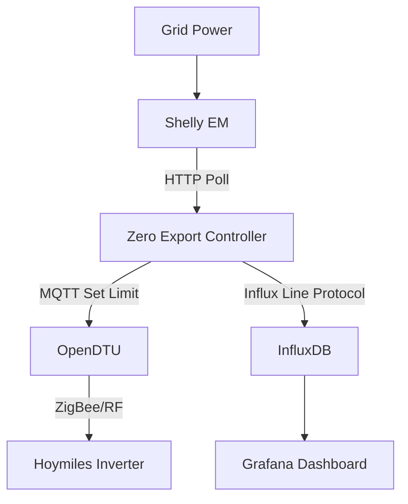

# Solar Panel Smart Metering & Zero Export Compliance


Custom monitoring system for solar panels using ESP32 and Raspberry Pi. It collects data and displays it through Home Assistant, while providing a robust zero-export control loop.

**Stack:** `Python` · `ESP32` · `Raspberry Pi` · `MQTT` · `Home Assistant` · `OpenDTU`

## 🌟 Overview

This project serves as a complete **Smart Metering** and **Zero Export** solution.

### Core Functionality
1.  **Zero Export Control**: The Python application reads from the grid meter (Shelly) and adjusts the inverter limit (via OpenDTU) to prevent export. This runs independently of Home Assistant.
2.  **Monitoring**: It publishes all data to MQTT, making it easily consumable by **Home Assistant** or the included **Grafana** dashboard for visualization.

## 🚀 Key Features

- **Smart Metering**: Publishes comprehensive data to MQTT, ready for Home Assistant sensors.
- **Zero Export**: Strict PID control to prevent grid feed-in.
- **Generic & Secure**: No hardcoded credentials. Configuration via `.env` and `config.yaml`.
- **Dockerized**: Easy deployment on Raspberry Pi or any Linux server.
- **Microservices**:
  - `app`: Python-based control logic (PID controller).
  - `verneMQ/Mosquitto`: MQTT communication.
  - `InfluxDB`: Time-series data storage.
  - `Grafana`: Visual dashboard.
- **OpenDTU Integration**: Seamlessly communicates with OpenDTU MQTT topics.

## 🏗️ Architecture



## 🛠️ Setup Guide

### 1. Prerequisites
- Docker & Docker Compose installed.
- OpenDTU set up and running (MQTT enabled).
- A power meter (Shelly EM/3EM) measuring grid usage.

### 2. Configuration

1. **Clone/Download** this repository.
2. **Environment Setup**:
   Copy the example environment file:
   ```bash
   cp .env.example .env
   ```
   Edit `.env` and fill in your specific details:
   - `MQTT_BROKER`: Hostname of this machine (or wherever Mosquitto runs).
   - `OPENDTU_IP`: IP of your OpenDTU device.
   - `SHELLY_IP`: IP of your Shelly meter.
   - Credentials for services.

3. **Application Config**:
   Edit `config.yaml` to fine-tune control parameters:
   - `target_point_w`: Target grid import (e.g., 15W).
   - `inverters`: **Crucial!** Update the serial number to match your inverter.
     ```yaml
     inverters:
       - serial: "11xxxxxxxxxx"
         enabled: true
         max_watt: 1500
     ```

### 3. Running

Start the stack:
```bash
docker compose up -d
```

Check logs:
```bash
docker compose logs -f app
```

### 4. Dashboard

Access Grafana at `http://localhost:3000`.
- **User**: `admin`
- **Password**: `admin` (or what you set in `.env`)

The **Zero Export** dashboard should be pre-provisioned.

## ⚠️ Important Notes

- **Network Mode**: The app container runs in `network_mode: host` to simplify mDNS discovery for OpenDTU. If you change this, ensure the container can reach your OpenDTU IP.
- **Safety**: Start with `dry_run` or monitor closely. Ensure your inverter limits are safe.

## ⚖️ Legal Disclaimer

**This project is intended for use ONLY in countries and jurisdictions where "zero export" or self-consumption systems are permitted and compliant with local laws.**

Grid regulations vary significantly by region. In some areas, connecting an inverter to the grid without specific utility approval—even in zero-export mode—may be prohibited. **You are solely responsible for ensuring your installation complies with all applicable local regulations and utility requirements.**

## 📜 License & Acknowledgments

**License**: GPL-3.0

This project is built upon the excellent work of the open-source community:

- **[HoymilesZeroExport](https://github.com/reserve85/HoymilesZeroExport)**: The original logic for zero-export control.
- **[OpenDTU](https://github.com/tbnobody/OpenDTU)**: The bridge enabling communication with Hoymiles inverters.
- **[OpenDTU Solar](https://www.opendtu.solar/)**: Documentation and project site for OpenDTU.
