# Solar Panel Smart Metering & Zero Export Compliance


Custom monitoring system for solar panels using ESP32 and Raspberry Pi. It collects real-time telemetry via MQTT, stores it in InfluxDB, and visualizes it through a Grafana dashboard, while providing a robust zero-export control loop.

**Stack:** `Python` · `ESP32` · `Raspberry Pi` · `MQTT` · `InfluxDB` · `Grafana` · `OpenDTU`

## 🌟 Overview

This project serves as a complete **Smart Metering** and **Zero Export** solution.

### Core Functionality
1.  **Zero Export Control**: The Python application reads from the grid meter (Generic Power Meter Interface) and adjusts the inverter limit (via OpenDTU) to prevent export.
2.  **Monitoring**: All telemetry (grid power, inverter metrics, panel data) is stored in **InfluxDB** and visualized through a comprehensive **Grafana** dashboard.

## 🚀 Key Features

- **Smart Metering**: Collects 12+ telemetry fields per inverter (AC/DC power, voltage, current, frequency, power factor, reactive power, temperature, efficiency, daily/total yield) and per-panel DC metrics.
- **Zero Export**: PID controller with anti-windup, fast grid-spike response, and configurable deadband to prevent grid feed-in while maximizing self-consumption.
- **HTTP Control API**: Toggle zero-export on/off via REST endpoint or directly from the Grafana dashboard — no MQTT client needed.
- **Always-On Monitoring**: Telemetry is recorded continuously even when the control loop is paused, so Grafana always has data.
- **Generic & Secure**: No hardcoded credentials. All secrets via `.env` and `config.yaml` with environment variable substitution.
- **Dockerized**: Single `docker compose up -d` deploys the full stack on Raspberry Pi or any Linux server.
- **Microservices**:
  - `app` — Python async control loop + HTTP API (port 8080)
  - `Mosquitto` — MQTT broker for OpenDTU communication
  - `InfluxDB` — Time-series storage for all telemetry
  - `Grafana` — Pre-provisioned dashboard with 7 stat panels and 11 time-series graphs
- **OpenDTU Integration**: Reads all inverter data via MQTT and sets power limits in real time.

## 🏗️ Architecture

```mermaid
graph TD
    Grid["⚡ Grid"] --> Meter["Power Meter"]
    Meter -- "HTTP Poll" --> App["Zero Export Controller"]

    App -- "MQTT Set Limit" --> Mosquitto["Mosquitto"]
    Mosquitto -- "MQTT" --> OpenDTU["OpenDTU (ESP32)"]
    OpenDTU -- "RF" --> Inverter["Hoymiles Inverter"]
    OpenDTU -- "MQTT Telemetry" --> Mosquitto
    Mosquitto -- "MQTT" --> App

    App -- "Write" --> InfluxDB["InfluxDB"]
    InfluxDB -- "Query" --> Grafana["Grafana Dashboard"]
    Grafana -- "HTTP Toggle" --> App
```



| Service | Port | Purpose |
|---|---|---|
| **App (HTTP API)** | `8080` | Toggle control, status endpoint |
| **Mosquitto** | `1883` | MQTT broker for OpenDTU ↔ App |
| **InfluxDB** | `8086` | Time-series telemetry storage |
| **Grafana** | `3000` | Dashboard visualization |

## 🛠️ Setup Guide

### 1. Prerequisites
- Docker & Docker Compose installed.
- OpenDTU set up and running (MQTT enabled).
- A supported **Power Meter** (e.g. Shelly EM/3EM or compatible HTTP meter) measuring grid usage.

### 2. Configuration

1. **Clone/Download** this repository.
2. **Environment Setup**:
   Copy the example environment file:
   ```bash
   cp .env.example .env
   ```
   Edit `.env` and fill in your specific details:
   - `MQTT_BROKER`: Hostname of this machine (or wherever Mosquitto runs).
   - `OPENDTU_IP`: IP of your OpenDTU device (e.g. `192.168.x.x`).
   - `METER_IP`: IP of your Power Meter (e.g. `192.168.x.x`).
   - Credentials for services.

3. **Application Config**:
   Edit `config.yaml` to fine-tune control parameters:
   - `target_point_w`: Target grid import (e.g., 15W).
   - `inverters`: **Crucial!** Update the serial number to match your inverter.
     ```yaml
     inverters:
       - serial: "11xxxxxxxxxx"
         enabled: true
         max_watt: 1500
     ```

### 3. Running

Start the stack:
```bash
docker compose up -d
```

Check logs:
```bash
docker compose logs -f app
```

### 4. Dashboard

Access Grafana at `http://localhost:3000` (default login: `admin` / `admin`).

The **Zero Export** dashboard is pre-provisioned with:
- **Stat panels**: Zero Export Status (clickable toggle), Power AC, Temperature, Production Today/Total, Peak Power AC/DC
- **Time-series graphs**: Grid Power, AC+DC Power & Limit, Voltage, Current, Panel DC Voltages, Temperature, Power Factor, Reactive Power, Frequency, Efficiency, Control Setpoint

### 5. HTTP Control API

The app exposes a lightweight API on port `8080`:

| Endpoint | Method | Description |
|---|---|---|
| `/api/toggle` | `GET` | Toggle zero-export on/off. Supports `?redirect=URL` for Grafana integration. |
| `/api/status` | `GET` | Returns `{"enabled": "on"}` or `{"enabled": "off"}` |

```bash
# Toggle via curl
curl http://localhost:8080/api/toggle

# Check status
curl http://localhost:8080/api/status

# Toggle via MQTT
docker exec mosquitto mosquitto_pub -t "zeropower/set/enabled" -m "on" -r
```

The **Zero Export Status** panel in Grafana is clickable — it calls the toggle endpoint and refreshes the dashboard.

## ⚠️ Important Notes

- **Network Mode**: The app container runs in `network_mode: host` to simplify mDNS discovery for OpenDTU. If you change this, ensure the container can reach your OpenDTU IP.
- **Safety**: Start with `dry_run` or monitor closely. Ensure your inverter limits are safe.

## ⚖️ Legal Disclaimer

**This project is intended for use ONLY in countries and jurisdictions where "zero export" or self-consumption systems are permitted and compliant with local laws.**

Grid regulations vary significantly by region. In some areas, connecting an inverter to the grid without specific utility approval—even in zero-export mode—may be prohibited. **You are solely responsible for ensuring your installation complies with all applicable local regulations and utility requirements.**

## 📜 License & Acknowledgments

**License**: GPL-3.0

This project is built upon the excellent work of the open-source community:

- **[HoymilesZeroExport](https://github.com/reserve85/HoymilesZeroExport)**: The original logic for zero-export control.
- **[OpenDTU](https://github.com/tbnobody/OpenDTU)**: The bridge enabling communication with Hoymiles inverters.
- **[OpenDTU Solar](https://www.opendtu.solar/)**: Documentation and project site for OpenDTU.
